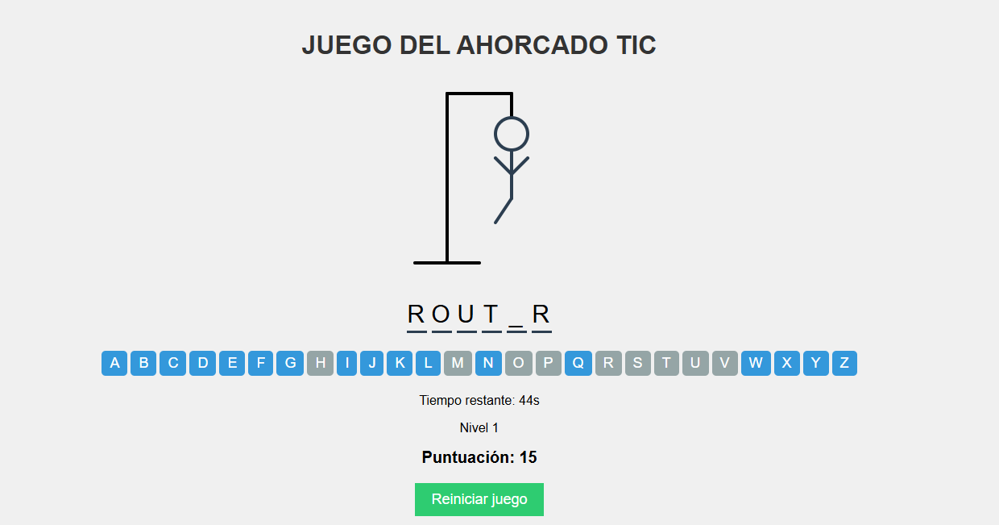

# 🎮 Juego del Ahorcado - TIC

  

Este proyecto es una implementación interactiva y educativa del clásico juego del ahorcado, desarrollado con terminología de Tecnologías de la Información y Comunicación (TIC).

## 🌐 Demo

Puedes jugar una versión en vivo del juego aquí: [Demo del Juego del Ahorcado](https://juego-ahorcado-tic.s3.sa-east-1.amazonaws.com/index.html)

## 🎯 Características

- Interfaz de usuario intuitiva y atractiva
- Múltiples niveles de dificultad
- Temporizador para añadir emoción al juego
- Sistema de puntuación
- Diseño responsivo para jugar en dispositivos móviles y de escritorio
- Animaciones suaves para una mejor experiencia de usuario

## 💻 Tecnologías Utilizadas

- HTML5
- CSS3
- JavaScript (ES6+)

## 🎮 Cómo Jugar

1. Visita la [demo del juego](https://juego-ahorcado-tic.s3.sa-east-1.amazonaws.com/index.html)
2. Selecciona una letra haciendo clic en los botones del teclado virtual
3. Intenta adivinar la palabra antes de que se complete el dibujo del ahorcado
4. ¡Gana puntos y avanza de nivel!

## 💻 Instalación Local

Si deseas ejecutar el juego en tu máquina local:

1. Clona este repositorio: git clone https://github.com/ejavierds/Ahorcado-TIC.git
2. Navega al directorio del proyecto: cd Ahorcado-TIC
3. Abre el archivo `index.html` en tu navegador web preferido

## 🤝 Contribuir

Las contribuciones son bienvenidas. Si tienes alguna idea para mejorar el juego:

1. Crear un nuevo asunto (issue) [https://github.com/ejavierds/Tres-en-Raya-Clasico/issues](https://github.com/ejavierds/Ahorcado-TIC/issues)
2. Generar un fork del repositorio [https://github.com/ejavierds/Tres-en-Raya-Clasico/forks](https://github.com/ejavierds/Ahorcado-TIC/forks)
3. Crear una nueva rama [https://github.com/ejavierds/Tres-en-Raya-Clasico/branches](https://github.com/ejavierds/Ahorcado-TIC/branches)
4. Abrir un pull request [https://github.com/ejavierds/Tres-en-Raya-Clasico/pulls](https://github.com/ejavierds/Ahorcado-TIC/pulls)

## 📝 Licencia

Distribuido bajo la Licencia Creative Commons (CC BY-NC-ND). Ver [LICENCIAS](https://descargas.intef.es/cedec/proyectoedia/guias/contenidos/guiasoftwarelibre/licencias_para_compartir.html) para más información.

## 📲 Contacto

* Edery Javier Rodríguez Alvarado - [@ejavierds](https://github.com/ejavierds) | [ederyrodriguezgmail.com](mailto:ederyrodriguezgmail.com)
* Link del Proyecto: [https://github.com/ejavierds/Ahorcado-TIC](https://github.com/ejavierds/Ahorcado-TIC)

## 🙏 Agradecimientos

- Inspirado en el clásico juego del Ahorcado.
- Referencias y recursos utilizados en el desarrollo: [Visual Studio Code](https://code.visualstudio.com/) | [Amazon Web Server (AWS)](https://aws.amazon.com)
